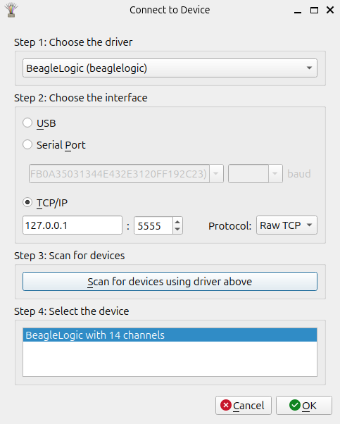
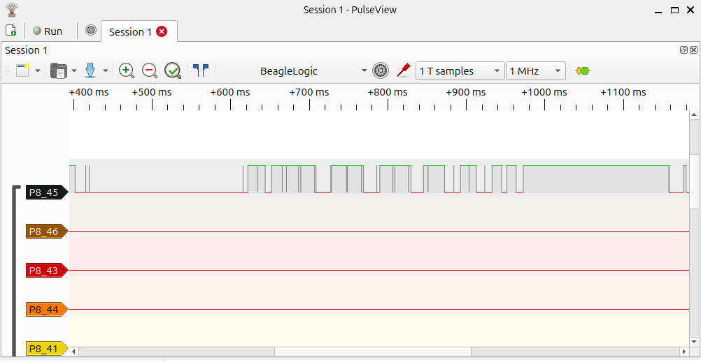

# Glasgow Interface Explorer with sigrok PulseView support

This fork adds a **logic analyzer** that emulates a BeagleLogic device for seamless integration with [**sigrok PulseView**](https://sigrok.org/wiki/PulseView).

## Getting Started
Example:
```
glasgow run analyzer_beagle -V 2.0 --i A0
```

Open PulseView and connect to a new device. Apply these settings:


Click on `Run`.



## Limitations
- This is only a very simple BeagleLogic emulation. Use this solution with caution and test thoroughly in your environment
- Only 8 channels
- Channels are not named correctly in PulseView
- No endless capturing. Set the numbner of samples accordingly in PulseView
